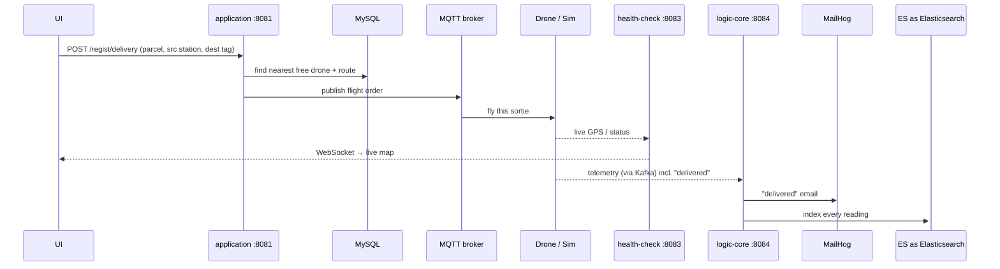

# AirPost Backend — the "brain" of the drone-delivery system

This repository is the **server side** of [AirPost](https://github.com/jsoone24/NC_AirPost), an
autonomous drone parcel-delivery platform. It is what turns *"a user clicked **deliver** in the web
app"* into *"the right drone flies the mission, everyone is notified, and every sensor reading is
stored and charted."*

It is **three small Go services** plus the data infrastructure they depend on. Each service has one
clear job; they talk to each other over HTTP, MQTT and Kafka.

> New to the project? Read the [top-level overview](https://github.com/jsoone24/NC_AirPost) first —
> it shows where this backend sits in the whole system. This README is the deep dive on the backend.

---

## 1. The three services (what each one is for)

| Service | Port | One-line job | Talks to |
|---|---|---|---|
| **`application`** | 8081 | The **front door & decision-maker**: REST API for the UI, stores orders/drones/stations/routes in MySQL, and **dispatches a flight** (picks the nearest free drone, plans the route, publishes the order to MQTT). | UI (REST), MySQL, MQTT, logic-core |
| **`logic-core`** | 8084 | The **data & rules engine**: consumes the telemetry firehose from **Kafka**, runs configurable rules (filters + actions, e.g. *"on a `delivered` event, send an email"*), archives everything to **Elasticsearch**, and turns the night-lamp logic on stations. | Kafka, Elasticsearch, SMTP (MailHog), application |
| **`health-check`** | 8083 (+ WebSocket 8085) | The **live-tracking pump**: receives drone position/status and pushes it to the UI map over a **WebSocket** so the operator sees the drone move in real time. | drones/sim, UI (WebSocket) |

Why split them? Each has a different runtime shape — `application` is request/response, `logic-core`
is a long-running stream consumer, `health-check` is a push socket. Splitting them means each can be
scaled, deployed and restarted independently (a telemetry spike never slows down placing an order).

---

## 2. How a delivery flows through the backend



- **Order:** `application` receives the order, queries MySQL for the nearest usable, not-busy drone,
  computes the route geometrically, marks the drone busy, and publishes the flight order to MQTT.
- **Track:** the drone (or simulator) streams its position; `health-check` relays it to the UI.
- **React & store:** sensor/telemetry events flow through Kafka into `logic-core`, which evaluates
  rules and writes to Elasticsearch; a `delivered` event triggers the email action.

---

## 3. Code layout (clean / hexagonal architecture)

Every service follows the same layered structure, so once you understand one you understand all three:

```
<service>/
├── main.go              # wiring: build repos → usecases → handlers, start the server
├── domain/
│   ├── model/           # the core entities (Node, Delivery, Path, StationDrone, Logic, Sink…)
│   └── repository/      # interfaces the domain needs (no DB details here)
├── usecase/             # business logic (e.g. "register a delivery", "dispatch a drone")
├── dataService/         # the actual implementations (sql/ for GORM+MySQL, memory/ for in-mem)
├── adapter/             # external-world adapters (Kafka, Elasticsearch, MQTT, page/DTO mappers)
├── rest/                # HTTP layer: routes + handlers (Gin), maps requests↔usecases
└── setting/             # config / env
```

Why this shape? The **domain** (what AirPost *is*) doesn't depend on MySQL, Kafka or Gin — those are
plugged in at the edges via interfaces. That makes the business rules testable in isolation (see the
`*_test.go` files) and lets storage/transport be swapped without touching the logic.

Key domain entities (in `application/domain/model`):

- **Node** — anything on the map: a **drone**, a **station** (helipad), or a **tag** (drop target).
  Distinguished by `Type` and `SinkID`. Drones self-register as `DRO-<station>`, stations as `STA`.
- **Delivery** — one parcel order (source station, destination tag, assigned drone, status).
- **Path / StationDrone** — routing and which drone belongs to which station.
- **Sink / Logic** — a telemetry source and the rules (filter + action) attached to it.

---

## 4. Run it

The whole backend + data stack comes up with one command (this also starts the UI and a dev mail
server). Run from this directory:

```bash
docker compose up --build -d
docker compose ps      # wait for application / logic-core / health-check / ui-next to be healthy
```

| URL | Service |
|---|---|
| http://localhost:4173 | Web UI (login `admin@airpost.local` / `admin`) |
| http://localhost:8081/swagger/index.html | `application` REST API (interactive Swagger) |
| http://localhost:5601 | Kibana (telemetry dashboards) |
| http://localhost:8025 | MailHog (captured "delivered" emails) |

On first start, `application` **seeds a demo topology** (stations, drones, tags, routes) so you can
place an order immediately. Tear down with `docker compose down` (add `-v` to wipe the MySQL/ES data).

### Ports

| Host | Service |
|---|---|
| 8081 | application (REST API) |
| 8084 | logic-core (rules / telemetry consumer) |
| 8083 / 8085 | health-check (HTTP / live-tracking WebSocket) |
| 4173 | UI (ui-next) |
| 3306 | MySQL |
| 9092 | Kafka |
| 9200 | Elasticsearch |
| 5601 | Kibana |
| 1883 | MQTT (mosquitto) |
| 1025 / 8025 | MailHog (SMTP / web) |

---

## 5. API at a glance

Full interactive docs: **http://localhost:8081/swagger/index.html**. The most-used endpoints:

| Method & path | Purpose |
|---|---|
| `POST /auth/login` | obtain a session token |
| `POST /regist/delivery` | **place a parcel order** → assigns a drone, plans the route, publishes the flight |
| `GET  /regist/delivery/:orderNum` | look up a delivery by tracking number |
| `POST /regist/node` | register a device (drone / station / tag) — used by the IoT self-registration |
| `GET  /regist/node/:sinkid` | list devices of a kind (drone / station / tag) |
| `DELETE /regist/node/:id` | remove a device (also clears its routes & deliveries) |
| `POST /regist/node/update` | update a node's live GPS |

A node's "kind" is decided by its **sink**: sink 1 = drones, 2 = stations, 3 = tags.

---

## 6. Local development (without Docker)

Each service is a standard Go module (Go 1.24). To build/test one service:

```bash
cd application      # or logic-core / health-check
go build ./...
go vet ./...
go test ./...
```

CI (`.github/workflows/ci.yml` in the umbrella repo) runs exactly these three steps for all services
on every push, so keep them green. The services expect MySQL/Kafka/Elasticsearch/MQTT reachable
(easiest via the `docker compose` stack above) and read their addresses from environment variables
(see `setting/` and `docker-compose.yml`).

---

## 7. Security note

The seeded accounts (`admin@airpost.local` / `admin`, `user@airpost.local` / `user`) and the open
dev MQTT broker are for **local development only**. Before any real deployment, change credentials,
lock down the broker, and put the services behind TLS. See `SECURITY.md` in the umbrella repo.
